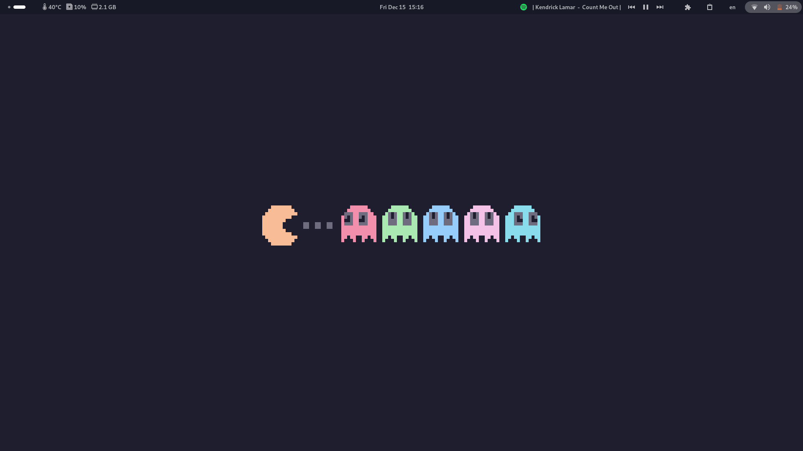
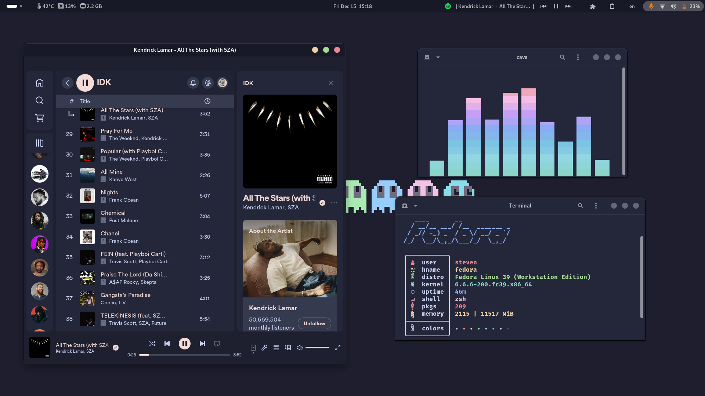
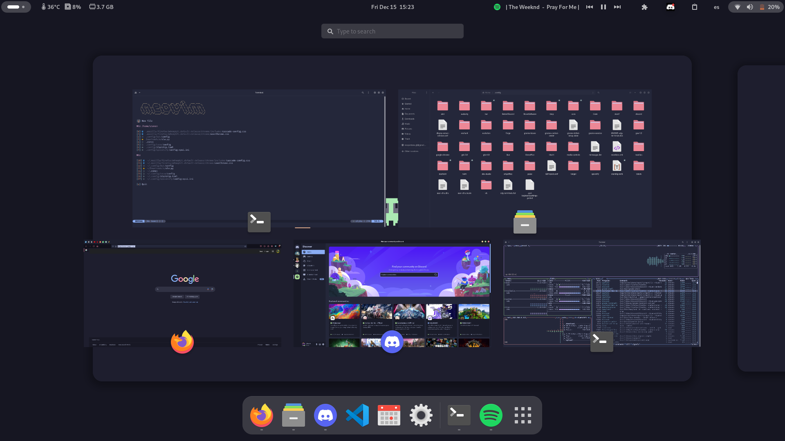
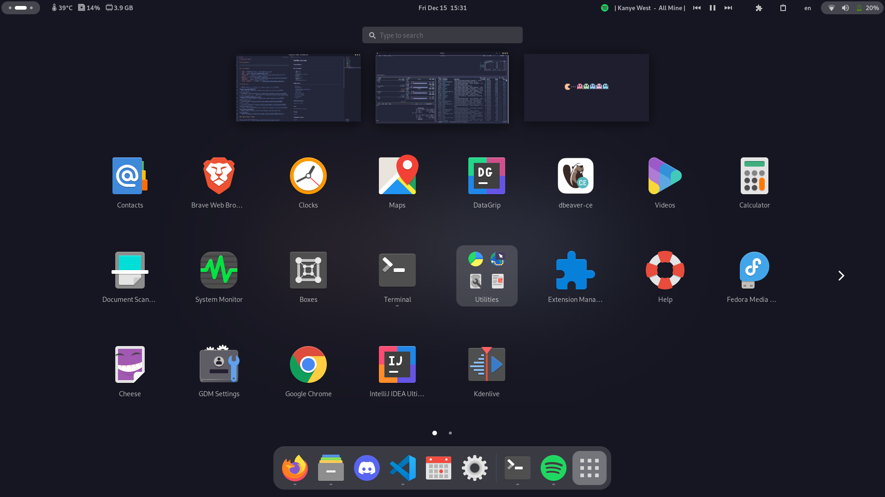

# Dotfiles Gnome

## ScreenShots

|  |  |
| ------------------------------ | ------------------------------ |
|  |  |

## Environment

- **OS**: [Fedora](https://fedoraproject.org/)
- **DE**: [Gnome](https://www.gnome.org/)
- **Terminal**: [Gnome-Terminal](https://apps.gnome.org/Console/)
- **Shell**: [Zsh](https://www.zsh.org/)
- **Browser**: [Firefox](https://www.mozilla.org/en-US/firefox/new/)
- **Editor**: [Nvim](https://neovim.io/)
- **Color Scheme**: [Catppuccin](https://github.com/catppuccin)

## Extensions

- [QSTweak](https://extensions.gnome.org/extension/5446/quick-settings-tweaker/)
- [Blur My Shell](https://extensions.gnome.org/extension/3193/blur-my-shell/)
- [Clipboard Indicator](https://extensions.gnome.org/extension/779/clipboard-indicator/) -[Extension List](https://extensions.gnome.org/extension/3088/extension-list/)
- [Media Controls](https://extensions.gnome.org/extension/4470/media-controls/)
- [Search Light](https://extensions.gnome.org/extension/5489/search-light/)
- [Top Bar Organizer](https://extensions.gnome.org/extension/4356/top-bar-organizer/)(
- [Tray Icons Reloaded](https://extensions.gnome.org/extension/2890/tray-icons-reloaded/)
- [User Themes](https://extensions.gnome.org/extension/19/user-themes/)
- [Vitals](https://extensions.gnome.org/extension/1460/vitals/)

### GTK & Shell Theme

[Catppuccin GTK Theme](https://github.com/catppuccin/gtk)

### Icons

[Papirus](https://github.com/PapirusDevelopmentTeam/papirus-icon-theme) with [Catppuccin Folders](https://github.com/catppuccin/papirus-folders)

### Prompt

[Starship](https://starship.rs/)

### Firefox User Theme

[Cascade](https://github.com/andreasgrafen/cascade)

### Wallpapers

[Wallpapers](/misc/backgrounds)

NOTE: Firefox, Visual Studio Code, Nvim, Gnome Terminal, Discord, etc.
contain color themes powered by [catppuccin](https://github.com/catppuccin/catppuccin)

Hyprland Dotfiles: [Hypr-Dots](https://github.com/StevenQuintanaGT/Hypr-Dotfiles)
